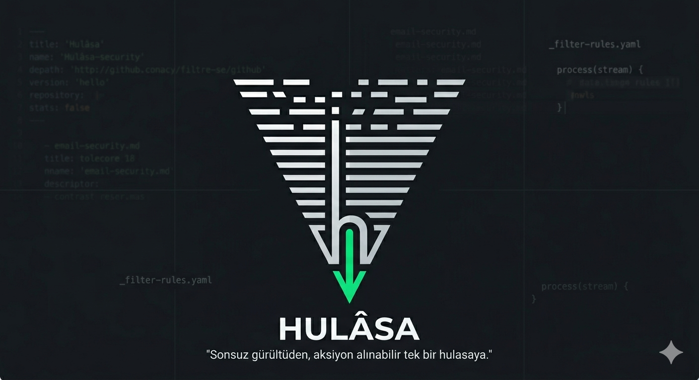

# 🗺️ HULÂSA | Siber Güvenlik ve Sistem Notları

<p align="center">
  
</p>

<h1 align="center">Hulâsa</h1>

<p align="center">
  <strong>"Sonsuz gürültüden, aksiyon alınabilir tek bir hulasaya."</strong>
</p>

---

**Bismillâhirrahmânirrahîm.**

> *Elhamdülillâhi Rabbi’l-âlemîn, vesselâtü vesselâmü alâ Rasûlinâ Muhammedin ve alâ âlihî ve sahbihî ecmaîn.*
> 
> *Sübhâneke lâ ilme lenâ illâ mâ allemtenâ, inneke ente’l-alîmü’l-hakîm. (Bakara-32)*
> 
> *Sübhâneke lâ fehme lenâ illâ mâ fehhemtenâ, inneke ente’l-cevâdü’l-kerîm.*
> 
> *Ammâ ba’d;*

---

## 🏛️ Dîbâce (Vizyon & Felsefe)

*"Sonsuz gürültüden, aksiyon alınabilir tek bir hulasaya."*

Siber güvenlik ve sistem programlama dünyasında bilgi eksikliği yok; aksine, aksiyona dönüştürülemeyen ve yapılandırılmamış bir bilgi fazlalığı var. Her gün yayımlanan yüzlerce sayfalık karmaşık dokümanlar, teorik gevezelikler ve devasa log yığınları arasında zaman kaybetmek, üretim safhasındaki (production) mühendisler için büyük bir lüks.

**hulasa**, bilginin yığınından süzülen rafine özün, siber güvenlik ve sistem programlama dikeyindeki teknik izdüşümüdür. Kurumsal e-posta güvenliği mimarileri, Linux sistem sıkılaştırma (hardening) süreçleri, ofansif/defansif operasyon notları ve sistem seviyesindeki yazılım geliştirme (Go, Rust, C) pratiklerine ait üretime hazır (production-ready) dökümanların ve süzülmüş notların bir arada toplandığı, gönüllülük esaslı dijital bir kütüphanedir.

Burada amaç her gün içerik tüketmek veya ticari bir platform yaratmak değil; önümüze çıkan, tecrübe edilen ve "gerçekten kayda değer" bulunan teknik pratiklerin saf özünü (hulasasını) çıkarıp kalıcı kılmaktır.

---

## 📂 Kütüphane Yapısı ve Nizam-ı Tasnifi

Yazılar ve teknik dokümanlar, tamamen terminal ve arama dostu (`scannable`) olacak şekilde flat bir mimariyle kategorize edilmiştir. Bu kütüphane içindeki tüm makalelere, güncel durumlara ve doğrudan bağlantılara tek bir merkezden göz gezdirmek için **[Kütüphane İndeksi (Fihrist)](index.md)** sayfasını ziyaret edebilirsiniz.

| Ana Katman                    | Alt Bileşenler & Odak Alanı                                                                                         | Döküman Türü          |
| :---------------------------- | :------------------------------------------------------------------------------------------------------------------ | :-------------------- |
| **📧 email-security/**        | Kurumsal e-posta güvenlik ağ geçitleri (SEG), SMTP hattı analizleri, milter mimarileri ve sıkılaştırma kılavuzları. | Teknik Risale         |
| **💻 endpoint-security/**     | EDR teknolojileri, merkezi ajan yönetimi, Active Directory nesne/OU görünürlük sınırlandırmaları.                   | Teknik Risale         |
| **🐧 linux-systems/**         | OS seviyesinde optimizasyon, kernel ve disk tamir operasyonları, Linux hardening adımları.                          | Teknik Risale         |
| **🛠️ software-development/** | Sistem programlama (Go, Rust, C), UI/UX quadrant yerleşim mantıkları ve mühendislik tabanlı mimari tasarımlar.      | Mimari Notlar         |
| **🎯 offensive-security/**    | Pentest süreçleri, Aktif Dizin sızma teknikleri, yetki yükseltme (PrivEsc) senaryoları ve web atak analizleri.      | Operasyonel Kılavuz   |
| **🛡️ defensive-security/**   | Mavi takım (Blue Team) operasyonları, sıkılaştırma rehberleri ve log/detection engineering pratikleri.              | Defansif Notlar       |
| **⚡ quick-notes/**            | Hızlı terminal komutları, cheat-sheet'ler ve hayat kurtaran regex kalıpları (Klasörsüz, tamamen etiket tabanlı).    | Mikro-Rehber (Shorts) |

---
### 📜 Yazım Standartları (Mebâdi-i Telif)

Bu kütüphaneye eklenecek, topluluk tarafından katkı sağlanacak veya kişisel heybeye atılacak her yeni makale, otomasyon sistemlerimizin (Fihrist üretici ve yayınlama betikleri) hatasız çalışması ve kurumsal hafızanın korunması için şu nizam-ı tasnif kurallarına uymak zorundadır:

#### 1. Zorunlu Metadata (Properties / YAML Frontmatter)
Her notun ilk satırı mutlak suretle `---` ile başlamalı ve aşağıdaki properties şablonu eksiksiz doldurulmalıdır. Bu, fihrist otomasyonumuzun kalbidir.

* `title`: Dokümanın fihristte görünecek resmi adı (Örn: `"Trend Micro DDEI'da Outbound Header Hiding"`).
* `description`: İçeriğin tek cümlelik rafine, net özeti.
* `category`: Bulunduğu klasör ismiyle birebir aynı olmalıdır (`email-security`, `linux-systems` vb.).
* `tags`: Dokümanın teknik etiketleri (Köşeli parantez içinde, virgülle ayrılmış: `[dkim, dns, troubleshooting]`).
* `status`: Yaşam döngüsü statüsü. Kabul edilen değerler: `Draft`, `Staged`, `Ready`, `Published`, `Deprecated`. *(Yalnızca `Ready` veya `Published` olanlar fihriste girer; `Draft` olanlar otomatik olarak repodan gizlenir.)*
* `date` & `last_updated`: `YYYY-MM-DD` formatında ilk oluşturulma ve son revizyon tarihleri.

#### 2. Özet Katmanı (Mebâdi-i Risale)
Properties bloğunun hemen altında, dokümanın amacını, hedef aldığı teknik katmanı (Örn: L7 SMTP, Application Katmanı SMTP Güvenliği) ve neyi çözmeyi vadettiğini özetleyen, `> 💡 **Mebâdi-i Risale:**` ibaresiyle başlayan akademik/teknik bir özet katmanı bulunmalıdır.

#### 3. Yapısal Kurallar
* **Dosya İsimlendirmesi:** Tüm dosya isimleri tamamen küçük harf ve `kebab-case.md` formatında olmalıdır (Örn: `dkim-key-syntax-error.md`).
* **Üslup ve Estetik:** Yazılar, teorik gürültüden uzak ancak kurumsal bir dîbâce (giriş) ve hâtime (kapanış) üslubuna sahip olmalı; tablolar ve net vurgularla desteklenmelidir.
* **Varlık Yönetimi:** Tüm ekran görüntüleri ve görsel şemalar `assets/images/` dizininde izole edilmelidir.

---

### 📝 Standart Risale Şablonu (Template)

Yeni notlarınızı oluştururken aşağıdaki ham kalıbı doğrudan kopyalayarak başlayabilirsiniz:

```yaml
---
title: "Makale veya Not Başlığı"
description: "İçeriğin tek cümlelik rafine özeti."
category: "email-security"
tags: [dkim, dns, troubleshooting]
status: "Draft"
date: "2026-06-12"
last_updated: "2026-06-12"
---

> 💡 **Mebâdi-i Risale:** Bu doküman, [İlgili Sistem/Katman/Teknoloji] bünyesinde meydana gelen [Problem/Senaryo] durumunu, kök neden analiziyle birlikte teknik derinlikte incelemek ve [Çözüm/Sıkılaştırma] metodolojilerini yapılandırmak amacıyla kaleme alınmıştır.

## 1. Giriş ve Arka Plan (Zemin)
Notun konusu olan problemenin veya mimarinin teknik arka planı.

## 2. Teknik Analiz ve Teşhis
Log çıktıları, hata kodları, mimari zafiyetler veya incelenen mekanizmanın derinlikleri.

## 3. Çözüm ve Uygulama (Sıkılaştırma)
Adım adım konfigürasyonlar, komut satırı betikleri ve üretim ortamı (production) testleri.
```
---
## 🏛️ Hâtime (Kapanış)

> *Sübhâne rabbike rabbi’l-izzeti ammâ yasifûn. Ve selâmün ale’l-mürselîn. Ve’l-hamdü lillâhi rabbi’l-âlemîn.*

**Hulasa-i Kelam:** Zamanımız kısıtlı, gürültü çok. Amacımız çok okumak değil, doğru ve rafine bilgiyi hızla heybemize atmak. Sinyali takip edin, gürültüyü birlikte filtreleyelim.