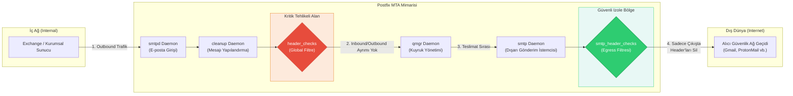

```mermaid
flowchart LR
    subgraph Internal ["İç Ağ (Internal)"]
        EX["Exchange / Kurumsal Sunucu"]
    end

    subgraph Postfix ["Postfix MTA Mimarisi"]
        SMTPD["smtpd Daemon<br>(E-posta Girişi)"]
        CLEANUP["cleanup Daemon<br>(Mesajı Yapılandırma)"]
        
        subgraph GlobalFilter ["Kritik Tehlikeli Alan"]
            HC{"header_checks<br>(Global Filtre)"}
        end
        
        QMGR["qmgr Daemon<br>(Kuyruk Yönetimi)"]
        SMTP_CLIENT["smtp Daemon<br>(Dışarı Gönderim İstemcisi)"]
        
        subgraph OutboundFilter ["Güvenli Izole Bölge"]
            SHC{"smtp_header_checks<br>(Egress Filtresi)"}
        end
    end

    subgraph Remote ["Dış Dünya (Internet)"]
        RECIPIENT["Alıcı Güvenlik Ağ Geçidi<br>(Gmail, ProtonMail vb.)"]
    end

    %% Akış Hatları
    EX -->|1. Outbound Trafik| SMTPD
    SMTPD --> CLEANUP
    CLEANUP --> HC
    HC -->|2. Inbound/Outbound Ayrımı Yok| QMGR
    QMGR -->|3. Teslimat Sırası| SMTP_CLIENT
    SMTP_CLIENT --> SHC
    SHC -->|4. Sadece Çıkışta<br>Header'ları Sil| RECIPIENT

    %% Renklendirme ve Vurgular
    style SHC fill:#2ecc71,stroke:#27ae60,stroke-width:2px,color:#fff
    style HC fill:#e74c3c,stroke:#c0392b,stroke-width:1px,color:#fff
    style OutboundFilter fill:#e8f8f5,stroke:#2ecc71,stroke-width:1px
    style GlobalFilter fill:#fdeadc,stroke:#e67e22,stroke-width:1px
```
